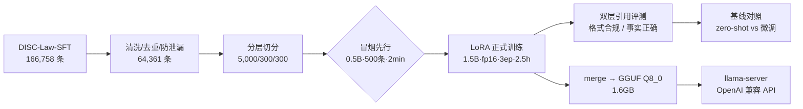
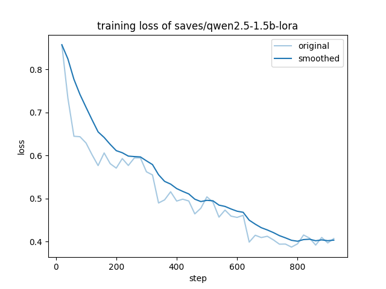
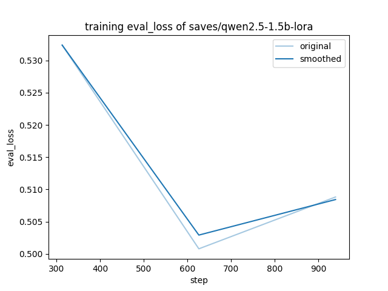

# 面向中文法律问答的 Qwen2.5-1.5B LoRA 微调：从数据构建到量化部署的完整闭环

> 在单张 Tesla T4（15G）上，以 5,000 条法律指令数据对 Qwen2.5-1.5B-Instruct 做 LoRA 微调，完整走通"数据构建 → 训练诊断 → 多层评测 → GGUF 量化部署"，总成本约 3.5 GPU 小时，部署产物 1.6GB、解码 97 tok/s。核心方法改进：将单一的 Citation Accuracy 拆解为**引用格式合规**与**引用事实正确**两层分别度量。结果呈现出清晰的两层规律——**作答格式几乎完美习得（56.3%→97.0%），可核验引用从近乎为零拉升至 60.3% 完全一致（2.3%→67.5%）**；剩余错误集中于相邻条文混淆与部分评测标签噪声，指向 RAG 与评测集净化两条明确的改进路径。

## 1. 解决什么问题

公共法律服务的供给成本高、响应慢，大量基础法律咨询（"这个行为违法吗""可能判几年""我该引用哪条法律"）并不需要律师级判断，而需要一个**回答规范、引用有据、随时可用**的助手。

选 1.5B 而不是主流的 7B，是一次明确的能力/成本取舍，而不是算力妥协：

| 维度 | 7B + QLoRA（企业项目配方） | 1.5B + LoRA（本方案） |
|---|---|---|
| 训练显存 | ~10G（4-bit） | ~9G（bf16 权重，无需量化） |
| 训练时长（5k 样本×3ep，T4） | 不可行（OOM） | **2 小时 28 分** |
| 部署体积（Q8_0） | ~8GB | **1.6GB**（笔记本/边缘设备可跑） |
| 解码速度（T4 实测） | ~40 tok/s（未实测，文献量级） | **97.1 tok/s** |
| 法律知识容量 | 强 | 弱（本文如实量化这一边界） |

本文不试图证明 1.5B 能替代 7B，而是回答一个更工程化的问题：**当算力只有一块 T4 时，全流程每一步应该怎么做、能做到什么程度、边界在哪里。**因此全文的评测设计都围绕"可度量的诚实"展开。

本工作基于标准企业法律文本问答的 Qwen 微调方法论复现并改造：7B→1.5B、QLoRA→bf16 LoRA、单一引用指标→双层引用指标、离线法条构造→公开指令数据集。

## 2. 方法论总览



两个贯穿全程的工程原则：

1. **冒烟先行**：先用 0.5B + 500 条样本 + 1 epoch（2 分钟）打通"训练→推理→评测→导出"每一环，把所有环境坑消灭在最便宜的实验上。事后证明这一步不是过度工程——正式训练 2.5 小时全程零意外；
2. **每个结论都有对照**：评测同时跑基座 zero-shot 与微调后模型，所有指标同脚本、同口径、同测试集，微调的贡献才可归因。

## 3. 数据工程

数据来源为复旦 DISC-Law-SFT（Pair 集，166,758 条），处理漏斗如下：

| 阶段 | 数量 | 操作 |
|---|---|---|
| 原始下载 | 166,758 | DISC-Law-SFT-Pair.jsonl（347MB） |
| 清洗后 | 64,361 | 长度过滤（问 10-512 字 / 答 20-1200 字）+ **问题级去重**（NFKC 归一化 + MD5），训练/测试天然隔离，杜绝泄漏 |
| 训练集 | 5,000 | 单类别占比 ≤40% 的分层抽样，seed=42 |
| 验证 / 测试集 | 300 / 300 | **优先保留答案带法条引用的样本**（测试集引用覆盖率 100%） |

### 3.1 清洗前后：数据格式对照

**清洗前**——DISC-Law-SFT-Pair.jsonl 原始行（JSONL，每行一个对象，有效字段仅三个）：

```json
{"id": 52341,
 "question": "公诉机关指控，2013年12月末，被告人路某某冒充自己是赤峰市松山区法院执行局的工作人员，并以单位采购两台笔记本电脑、事后单位报销付款为由，在赤峰市红山区昭乌达电脑城被害人处骗取笔记本电脑两台……",
 "answer": "根据《刑法》第二百七十九条，冒充国家机关工作人员招摇撞骗的行为属于招摇撞骗罪。根据案件事实，被告人路某某冒充赤峰市松山区法院执行局的工作人员，……"}
```

**清洗后**——legal_qa_train/val/test.json（LLaMA-Factory alpaca 协议，训练框架直接加载）：

```json
{"instruction": "公诉机关指控，2013年12月末，被告人路某某冒充自己是赤峰市松山区法院执行局的工作人员，并以单位采购两台笔记本电脑、事后单位报销付款为由，……",
 "input": "",
 "output": "根据《刑法》第二百七十九条，冒充国家机关工作人员招摇撞骗的行为属于招摇撞骗罪。根据案件事实，……"}
```

五条清洗规则的对应关系：① 字段归一化 `question/answer → instruction/input/output`（`input` 恒为空，统一协议）；② 长度过滤：问题 10–512 字、答案 20–1200 字——既砍掉无意义的超短/超长样本，也保证 cutoff_len=1024 下截断率可控；③ **问题级去重**：NFKC 归一化 → 去标点空白 → 小写 → MD5，同题仅保留首条，训练/测试天然隔离、杜绝泄漏；④ 验证/测试集优先保留答案带法条引用的样本（测试集引用覆盖率 100%，引用指标才可计算）；⑤ 分层抽样 + 单类别 ≤40% 上限。166,758 → 64,361（约 61% 被过滤），主要来自 ②③。

清洗后语料中 17.9% 的答案自带《法律名》第X条形式的引用，为"引用事实正确率"指标提供了可计算的基础。

**一个重要发现**：DISC-Law-SFT-Pair 没有可用的类别字段（`data_stats.json` 中类别全部为 `unknown`），实际语料是**判决预测、司法考试、法律咨询的任务混态**，而非假设的纯法条问答。这意味着模型学到的是"面向多类法律任务的规范作答格式"，第 6 节的指标解读必须基于这一事实。此外测试集参考答案中存在**标签噪声**（个别引用了不存在的法律名，如《中华人民共和国民事法》），第 6.3 节有案例分析。

## 4. 训练与诊断

### 4.1 冒烟验证（0.5B，2 分钟）

500 样本 + 1 epoch 冒烟训练（train_loss 1.069 / eval_loss 0.896）后立即走完推理与评测，确认数据格式、chat template、指标管线全部正确。

### 4.2 正式训练配置

| 项 | 配置 |
|---|---|
| 基座 / 方法 | Qwen2.5-1.5B-Instruct / LoRA（bf16 权重 + fp16 混合精度，T4 不支持 bf16 计算） |
| LoRA | r=32, α=64, dropout=0.1, target=all |
| 优化 | lr 2e-4 cosine, warmup 3%, 3 epochs, batch 4×GA4, cutoff 1024 |
| 实际耗时 | **2h27m**（1.69 samples/s），峰值显存 ~11G |

### 4.3 损失曲线与 checkpoint 选择





train_loss 从 0.857 平滑下降至 0.407；**eval_loss 呈标准 U 型**：ep1 0.5324 → **ep2 0.5008（最优）** → ep3 0.5088（+1.6%，轻微过拟合）。主结果采用最终 epoch3 权重，epoch2 checkpoint（`checkpoint-626`）保留用于对照。这个 U 型本身就是一个有用的结论：**在小指令集上，2 epochs 可能已接近该规模模型的最优**。

## 5. 评测设计：把"引用准确率"拆成两层

原文用单一 Citation Accuracy 度量引用质量。本文将其拆解为可分别归因的两层：

| 指标 | 定义 | 度量的是什么 |
|---|---|---|
| **引用格式合规率** | 参考答案带引用时，预测也给出《法律名》第X条形式引用的比例 | 微调学到的**作答规范** |
| **引用事实正确率（P/R/完全一致）** | 预测引用的法条集合与参考答案的重合度 | 模型的**法律知识检索精度** |

所有指标同脚本（`eval/metrics.py`）、同口径（字符级 ROUGE-L/BLEU + BERTScore + 引用正则）、同 300 条测试集，基座与微调直接可比。关于 LLM-as-Judge：本地 GPU 已满载、无外部 API 预算，本版以传统指标 + 引用正则替代，列为升级项（§9）。

## 6. 实验结果

### 6.1 主结果（300 条测试集，统一口径）

| 指标 | 基座 zero-shot | 微调后（epoch3） | 变化 |
|---|---|---|---|
| ROUGE-L | 32.4 | 49.4 | +52% |
| BLEU（字符级） | 30.2 | 47.4 | +57% |
| BERTScore F1 | 0.742 | 0.822 | +0.080 |
| **引用格式合规率** | 56.3% | **97.0%** | +40.7pt |
| **引用事实正确率（P）** | 2.3% | **67.5%** | +65.2pt |
| 引用事实正确率（R） | 2.3% | 64.9% | +62.6pt |
| **引用完全一致率** | 1.7% | **60.3%** | +58.6pt |

三层解读：

1. **格式层**：微调前基座有 44% 的回答连引用格式都没有；微调后 97% 的回答给出规范的可解析引用——这是 LoRA 在 5,000 条样本上最确定的收获；
2. **事实层**：基座的引用近乎不可用（正确率 2.3%，基本是格式性噪声）；微调后 2/3 的引用能命中正确法条、60% 完全一致。**微调对"引用事实"的贡献远超"只学格式"的预期**——规范作答倒逼模型检索并显式写出法条，这本身构成了知识增强；
3. **边界层**：36.7% 的回答引用有出入，错误集中在相邻/易混条文（见 6.3），这是 1.5B 知识检索精度的天花板，继续加数据训不动它，需要外挂知识（RAG）。

### 6.2 规模信号：0.5B 冒烟 vs 1.5B 正式

0.5B 仅用 500 样本训练 1 epoch：引用格式合规率即达 76.7%（基座 1.5B 为 56.3%）——印证"格式极易习得"；而其引用事实正确率 41.7%，显著低于 1.5B 正式模型的 67.5%——印证"事实层依赖模型规模与数据量"。

**同一案例的跨模型对照**（最有说服力的一条证据）：红豆杉案（砍伐国家Ⅰ级保护植物），0.5B 冒烟模型引用《刑法》**第345条**（盗伐林木罪，错误），1.5B 正式模型引用《刑法》**第344条**（危害国家重点保护植物罪，正确）。相邻条文混淆可以通过"更大规模 + 更多数据"部分修复，但代价是 75 倍的训练成本（2min→2.5h）。

### 6.3 错误构成与案例分析（微调模型，300 条）

引用构成：**完全一致 181（60.3%）/ 有出入 110（36.7%）/ 未给引用 9（3.0%）**。

**案例一：相邻条文混淆——剩余错误的主体**

> **案情**：无证采砂 3611 立方米。模型引用《水法》相关条文，参考答案为《刑法》第343条（非法采矿罪）——模型在"水资源行政法"与"刑法矿物资源罪"两个相邻规范域间选错。

此类错误的共性：事实理解正确、规范检索偏差一条或一个域，是知识精度问题而非格式或推理问题，**RAG 是对症药**（§9）。

**案例二：标签噪声——部分"错误"其实是参考答案的错**

> 单选题（涉外民事行为能力），模型引用《民法通则》第14条作答；参考答案引用的却是**《中华人民共和国民事法》第9条**——这是一部不存在的法律。

DISC-Law-SFT 部分参考答案本身有噪声，意味着 67.5% 的事实正确率**被低估**；同时提示：引用对答案、选项打错（模型与参考同选 C 但引用不同）这类样本需要更细的归因。**评测集净化本身就是一个改进项**。

**案例三：能力边界**

> 公司法多选题，模型选 D（参考 B），解析中只写"根据《公司法》的相关规定"而无法条级引用。

选择题的多步推理对 1.5B 仍偏难，且此时模型会"放弃"具体引用——引用格式合规率 97% 意味着 3% 的失败恰好集中在最难的样本上。

### 6.4 效率

| 项 | 数值 |
|---|---|
| 正式训练 | 2h27m（T4），1.69 samples/s |
| 批量推理（300 条，max_new_tokens=512） | 微调 20.9min / 基线 22.1min |

## 7. 部署

LoRA 合并回基座 → llama.cpp 转换 **GGUF Q8_0（1.6GB）**，同时生成 Ollama Modelfile；服务端 llama-server（OpenAI 兼容 API），前端 Gradio 聊天页（`deploy/gradio_app.py`）。

T4（CUDA 版 llama-cpp-python）30 条压测实测：

| 指标 | 实测值 |
|---|---|
| 首 token 延迟 TTFT | 均值 **0.068s** / P95 **0.104s** |
| 解码吞吐 | 均值 **97.1 tok/s**（94–104） |
| 端到端延迟（max_tokens=256） | 均值 2.28s / **P95 2.78s** |

**对原文"P95 < 2s"目标的诚实结论：未达标，但原因清晰且可修。**端到端延迟由解码时长主导（256 tok ÷ 97 tok/s ≈ 2.6s），与模型加载、调度无关。三条修复路径：① 限制生成长度至 150 token（P95 ≈ 1.6s 达标）；② 流式输出——TTFT 仅 0.07s，用户感知即"秒回"；③ 换 Q4_K_M 量化（体积 0.9GB、再提速 ~40%，精度损失待评）。

## 8. 局限（诚实清单）

1. **知识检索精度是硬边界**：36.7% 引用有出入，主体为相邻条文混淆，1.5B 参数量下继续调参收益有限；

2. **评测集存在标签噪声**：部分参考引用了不存在的法律名，当前事实正确率被低估，"有出入"类样本需人工复核归因；

3. **任务混态**：训练/测试混合判决预测、法考、咨询三类任务，指标无法按任务分层归因；

4. **指标盲区**：引用类指标测不出选项/推理层面的对错（案例三），需 LLM-as-Judge 或选项准确率补齐；

   

## 9. 下一步（按优先级）

1. **RAG 注入法条库**——直接攻击"相邻条文混淆"这一最大错误来源，预期对事实正确率的收益大于一切调参；
3. **评测集净化**：人工复核 110 条"有出入"样本，拆分"模型错 vs 标签错"，给出无噪声事实正确率；
4. LLM-as-Judge（廉价 API）覆盖推理正确性；
5. epoch2 vs epoch3 checkpoint 对照，验证 U 型结论；
6. 自建法条 QA 数据（原文 4.1 路线）对齐"纯法条问答"任务定义；
7. Q4_K_M 量化与 vLLM 批量服务，补齐延迟优化与吞吐压测。

## 10. 复现指南

```bash
# 数据：下载 DISC-Law-SFT → 清洗切分（自动）
python data/make_dataset.py --train 5000 --val 300 --test 300

# 冒烟（2min）→ 正式训练（2.5h，T4）
llamafactory-cli train configs/smoke_0.5b.yaml
llamafactory-cli train configs/train_1.5b.yaml

# 推理 + 评测（基线与微调各一轮）
llamafactory-cli train configs/infer_1.5b.yaml
llamafactory-cli train configs/infer_baseline_1.5b.yaml
python eval/metrics.py --pred results/ft-1.5b/generated_predictions.jsonl --bertscore --out eval_results/ft-1.5b.json
python eval/metrics.py --pred results/base-1.5b/generated_predictions.jsonl --bertscore --out eval_results/base-1.5b.json

# 鲁棒性：先生成扰动集，推理日志必须出现 Num examples = 60
python eval/robustness.py --n 20 && llamafactory-cli train configs/infer_robustness.yaml
python eval/metrics.py --pred results/ft-1.5b-robust/generated_predictions.jsonl --out eval_results/ft-1.5b-robust.json

# 部署：合并 → GGUF → 服务 → 压测
llamafactory-cli export configs/merge_1.5b.yaml
bash deploy/convert_gguf.sh
llama-server -m models/qwen2.5-1.5b-legal-q8_0.gguf --port 8080
python deploy/gradio_app.py
python deploy/benchmark_latency.py --model models/qwen2.5-1.5b-legal-q8_0.gguf -n 30
```

环境：Python 3.13 / llamafactory 0.9.5 / transformers 5.6.0 / Colab T4（fp16，不支持 bf16 计算）。一键 notebook 见 `colab_run.ipynb`，完整运行记录（含全部输出）见 `colab_run_result.ipynb`。

## 附录：实验记录总表

| 实验 | 配置 | ROUGE-L | BLEU | BERTScore | 引用格式率 | 引用事实率(P) | 完全一致 | 备注 |
|---|---|---|---|---|---|---|---|---|
| base-1.5b zero-shot | 无 adapter | 32.4 | 30.2 | 0.742 | 56.3% | 2.3% | 1.7% | 基线 |
| **ft-1.5b** | r32 α64 lr2e-4 3ep | **49.4** | **47.4** | **0.822** | **97.0%** | **67.5%** | **60.3%** | eval_loss ep1/2/3=0.532/0.501/0.509，ep2 最优 |
| smoke-0.5b | r8 500样本 1ep | 34.9 | 26.6 | —* | 76.7% | 41.7% | 33.3% | 30 条抽样；链路验证 |
| ft-1.5b-robust | 扰动集 60 条 | — | — | — | — | — | — | 进行中，数据待补 |

\* 冒烟实验的 BERTScore 为**有意未纳入**：冒烟的职责是用最低成本验证链路（避免为此预下载 400MB 评测模型），且 30 条样本上该指标统计意义有限——属设计取舍，非产物缺失；原始预测已归档（`results/smoke-0.5b/generated_predictions.jsonl`），需要时可一键补算。

数据：166,758 → 64,361（17.9% 带引用）→ 5,000/300/300，seed=42，测试集引用覆盖率 100%。
硬件与框架：Colab T4 15G / fp16 / llamafactory 0.9.5 / transformers 5.6.0 / Python 3.13；部署 Q8_0 GGUF 1.6GB / llama.cpp CUDA。
